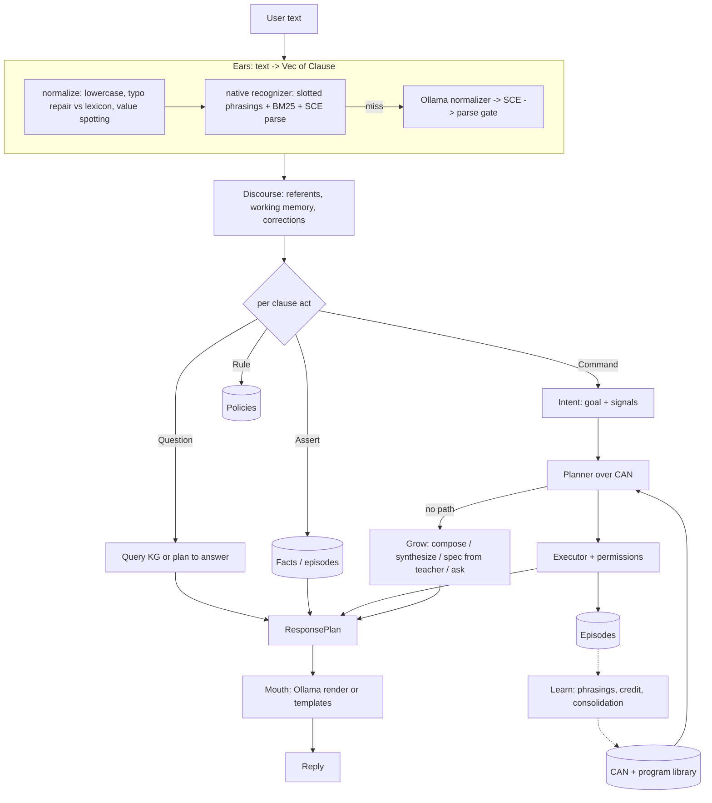

# Spoon: plan of record

Spoon is a conversational AI that is not an LLM. It grows its own Concept Action
Network (CAN) and program library by composition and synthesis. Small local LLMs
(Ollama, <= 4b) are allowed in exactly three places: ears (input codec), mouth
(output codec), teacher (pretrain / spec generation). Nothing in the interior
(retrieve, plan, choose, execute, learn) is a model. Every LLM seat is behind a
trait and has a native implementation that is meant to take over.

See `STATUS.md` for what is actually wired and working right now. If STATUS and
this file disagree, STATUS wins.

## Decisions (locked with Keal, 2026-09-01)

| Topic | Decision |
|---|---|
| Runtime | Rust, one binary (`spoon`). axum for HTTP, stdio for REPL/JSON-lines. Inspector = static HTML served by the binary. No TS layer. |
| Interfaces | `spoon repl`, `spoon stdio` (JSON lines), `spoon serve` (OpenAI `/v1/chat/completions` with SSE + `/v1/models` + `/debug/*` + `/inspector`), `spoon teach`, `spoon bench`, `spoon export/import`. |
| Ears | Native recognizer first (learned slotted phrasings + BM25 + typo repair against the CAN lexicon + SCE parser). Ollama normalizer (messy English -> SCE) only on miss. SCE parser is the hard gate on LLM output. Every LLM pair becomes native training data. Headline metric: `ears_llm_rate`. |
| Controlled language | SCE = ACE-inspired controlled English with an open lexicon that IS the CAN (nouns = concepts, verbs = actions/relations). Own Earley parser, no Prolog. |
| Mouth | Interior emits a structured `ResponsePlan`; Ollama renders it into casual English under a no-new-facts rule (values in plan must appear in output, checked). Deterministic template realizer is the fallback and the offline mode. |
| Teacher | Broad powers during pretrain (annotated utterance pairs, phrasings, concept/action models, I/O example specs, dialog phrasings). Live: only generates I/O example specs when synthesis needs one. Never emits executable bodies as the default path. Configurable to a frontier model via any OpenAI-compatible endpoint. |
| Programs | Spoon's typed IR only. Effects only via kernel primitives with effect levels. |
| Domains v1 | conversation, episodic memory, math/dates, text/lists/json, fs (scoped), http+json, bounded shell, code reading, structured world knowledge (Wikidata/WordNet), "life advice" as a conversational curriculum domain. |
| Permissions | Modes: `always-ask`, `ask-writes` (default), `bypass`. Effect levels: pure, read, write, network, shell. |
| Persistence | SQLite single brain. `spoon export` writes a git-friendly JSON seed (the distributable baseline). `spoon import` loads one. |
| Non-LLM ML | Anything goes in the interior as long as it does not make the choice: counts, CRF-style taggers, BM25, edit distance, tiny embeddings if needed. |
| Success | Conversational, tries its best, asks when unsure, and when told it is wrong it adapts and the fix sticks across restarts. Composes known capabilities for unseen requests. Learns a new capability mid-conversation and reuses it next session without the teacher. |
| Reuse | Steal data/ideas from `~/Git/Personal/ekg`, `/tmp/ekg-ai` (github.com/kealjones/ekg-ai), `~/Downloads/ace_normalizer_spike`. No code ports. External data only if licensed and attributed (`ATTRIBUTIONS.md`). |

## Lessons from the predecessors (do not repeat)

1. Wire or delete. Every milestone ends with an end-to-end demo through the real REPL. No module is "done" until a turn uses it.
2. No god file. `cycle.rs` in ekg hit 5.7k lines. Modules stay under ~800 lines; the turn loop is a short orchestrator.
3. The LLM never chooses. Not which capability, not the plan, not the answer. If removing Ollama removes competence beyond parsing slang and phrasing replies, the design is broken.
4. Teacher never authors executable bodies by default. It proposes structure and specs; the synthesizer writes programs and verifies them.
5. Search budgets are nodes + time + memory, never depth alone. Synthesis must be able to invent constants (from the utterance and a small pool).
6. A learned artifact named after a task family is a cache entry, not a capability. Prefer decomposed programs; consolidate only on reuse evidence.
7. Do not derive the seed from the benchmark. Hold out.
8. One compositional language learner, not four stacked parsers.
9. Measure from day one: `ears_llm_rate`, `interior_llm_calls` (must be 0), reuse rate, synthesis hit vs teacher fallback, silent-recall-miss.

## Prior art map (what each part steals from)

| Part | Lineage | What we take |
|---|---|---|
| CAN + planner | Viv Labs / Bixby patents (US20140380268, US9292262B2) | typed concepts with is-a / has-a / role-of, cardinality, actions as typed functions, null-plan beam search connecting signals to goal, placeholders -> prompts, planner feasibility as a parse-ranking signal, choice points |
| Controlled language | Attempto Controlled English / APE, DRT (Kamp) | ACE-shaped grammar, DRS-style clauses with referents, quantifiers, if-then, reported speech; open lexicon instead of clex |
| Semantic parsing + lexicon learning | SEMPRE / SippyCup (Liang), CCG lexicon induction (Zettlemoyer & Collins), Winograd SHRDLU procedural semantics | learn (phrase -> predicate) lexicon entries from (utterance, logical form) pairs; parse-score by executability |
| Ears robustness | Rasa/Snips NLU, Duckling, SymSpell | gazetteer + rule value spotting (numbers, dates, quoted strings, paths), edit-distance typo repair against a live lexicon |
| Dialog management | Information State Update (TrindiKit), RavenClaw, plan-based dialog (Allen/Perrault) | dialog acts, questions-under-discussion stack, grounding/ack moves, clarification as first-class capability |
| Output | Viv dialog templates, NLG micro-planning | event/fragment templates with binding contexts; LLM as surface realizer only |
| Program synthesis | FlashMeta/FlashFill, DreamCoder wake, observational equivalence (Transit/Escher), Popper ILP | typed enumerative search with OE pruning, budget in nodes+time, constants from utterance, verify on examples |
| Library learning | DreamCoder sleep, Stitch, EC2, LILO | provisional -> consolidated tiers, compression utility on reuse, naming, eviction |
| Memory | ACT-R base-level activation, Generative Agents (recency/importance/relevance), bi-temporal facts (Graphiti) | activation = recency + frequency + match; episodes never lossy; facts with valid-time |
| Knowledge | Cyc lesson (hand ontology does not scale), Wikidata, WordNet, ConceptNet | pull structured facts on demand as capabilities, cite source, do not pre-ingest the world |
| Conversational baseline | ELIZA/AIML/ChatScript (pattern reply) as a warning, not a model | conversation moves are capabilities with phrasings, not regex replies |

Third-party crates are fine for plumbing (SQLite, HTTP, BM25/tantivy, stemming, edit distance, date parsing, Earley if a good one exists). Never for the choosing.

## Architecture



### Crate layout (single crate, modules)

```
src/
  main.rs            CLI entry (clap): repl | stdio | serve | teach | bench | export | import
  lib.rs             module wiring, Spoon struct (the one orchestrator), turn()
  types/             shared vocabulary. Everything depends on this, it depends on nothing.
    value.rs         Value, Type
    can.rs           Concept, Action, Property, Effect, Tier, ids
    ir.rs            Program, Expr
    clause.rs        Clause, Referent, Pred, Term, Act (ears output)
    intent.rs        Intent, Signal, Plan, PlanNode
    response.rs      ResponsePlan, Move
    episode.rs       Episode, TurnRecord, metrics
  store/             SQLite persistence + JSON seed export/import
  kernel/            evaluator, primitives (math, text, list, json, time, fs, http, shell, memory, knowledge)
  lang/              SCE grammar + Earley parser, lexicon view of the CAN, arithmetic exprs
  ears/              normalize, native recognizer, phrasing induction, Ollama normalizer, Ears trait
  discourse/         referent resolution, working memory, correction detection
  mind/              planner, executor, permissions, facts query, rules
  grow/              synthesizer (typed enumerative, budgeted), consolidation, teacher specs
  mouth/             ResponsePlan -> text (templates, Ollama renderer, fact-preservation check)
  teacher/           curriculum generation, pretrain runner, LLM client (Ollama + OpenAI-compatible)
  server/            axum: OpenAI API, debug endpoints, inspector static
  bench/             ACE corpus (158), bAbI probes, weaning report
```

## Milestones (each ends wired, demoable in the REPL)

- **M0 Kernel + language.** Cargo project, types, SQLite store, Value/Type/IR evaluator, Stage 0 primitives, SCE grammar + parser, REPL that parses SCE and evaluates `Assistant, calculate 3 / 500 * 3600!`.
- **M1 Interior.** CAN seeded from primitives, planner, executor, permissions, fact store + question answering over facts, discourse referents. `John owns a dog. Who owns a dog?` and `open a file X and save X` style plans with placeholders/prompts.
- **M2 Codec + surfaces.** Ollama normalizer with retrieved vocabulary, parser gate, native recognizer + phrasing induction from pairs, mouth renderer + template fallback, OpenAI API with SSE, stdio JSON lines, metrics. Messy input end-to-end.
- **M3 Growth.** Budgeted typed synthesis from I/O examples, teacher spec generation (Ollama or frontier), composition consolidation on reuse, corrections ("no I meant", "X means Y") that persist.
- **M4 Pretrain + ship.** Curriculum generator, overnight `spoon teach` runs, seed export as baseline, inspector UI, benches (ACE 158, bAbI subset, weaning curve), README, ATTRIBUTIONS.

## Subagent protocol

Subagents (Sonnet) are used for parallel module work. Each gets: the exact
files it owns, the `types/` contracts (read-only for them), the tests it must
make pass, and the rule that it may not touch other modules. The orchestrator
(this session) owns `types/`, `lib.rs`, `main.rs`, wiring, and STATUS.md.
